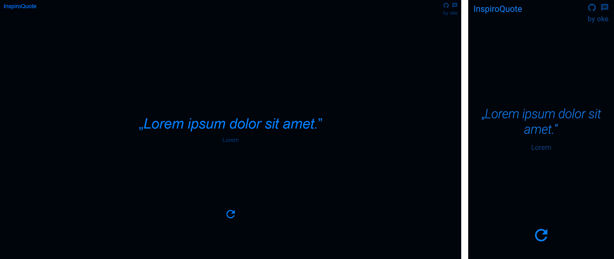

# 💡 InspiroQuote


The website, built using React and TypeScript, shows a quote and its author. This information comes from a PostgreSQL database hosted in Supabase. The site allows you to change the quote using a button. The project uses the Material UI (MUI) library, which provides a nice look. Additionally, the site is fully responsive, making it easy to use on different devices.



[**➥ Live**](https://oke225.github.io/InspiroQuote/)

## ⚙️ Technologies Used

- React
- TypeScript
- MUI - Material UI
- PostgreSQL
- Supabase
- Sass

## 💻 Features

- **Display and change quotes** - The website shows a quote with it is author and let's you change the quote using a button.
- **Material UI (MUI) design** - The website uses Material UI for a modern and nice look.
- **PostgreSQL database integration** - Quotes and authors are taken from a PostgreSQL database hosted in Supabase.
- **Responsive design** - The website works well on computers, tablets, and smartphones.

## 📘 Local Setup

1. **Clone the Repository:**

   Open your terminal and clone the GitHub repository using:

   ```bash
   git clone https://github.com/OKE225/InspiroQuote.git
   ```

2. **Install Dependencies:**

   Navigate to the project directory:

   ```bash
   cd InspiroQuote
   ```

   Then install all dependencies using npm or yarn:

   ```bash
   npm install
   ```

   or

   ```bash
   yarn install
   ```

3. **Start the Application:**

   To run the application locally, use:

   ```bash
   npm start
   ```

   or

   ```bash
   yarn start
   ```

## 📄 License

The [MIT License](./LICENSE) (MIT). Please see License File for more information.

## 🔎 See Also

[GitHub profile](https://github.com/OKE225)
